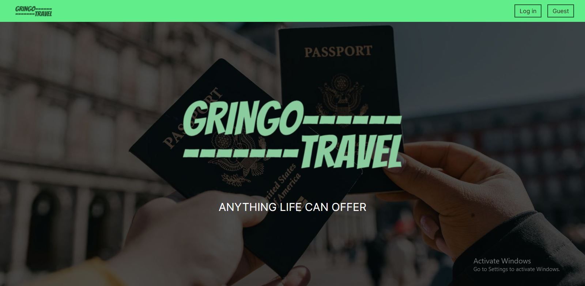
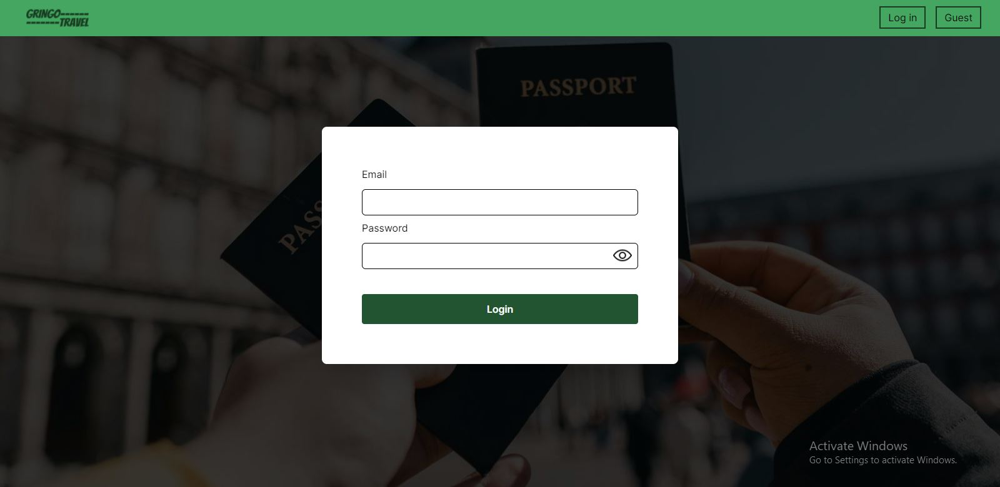
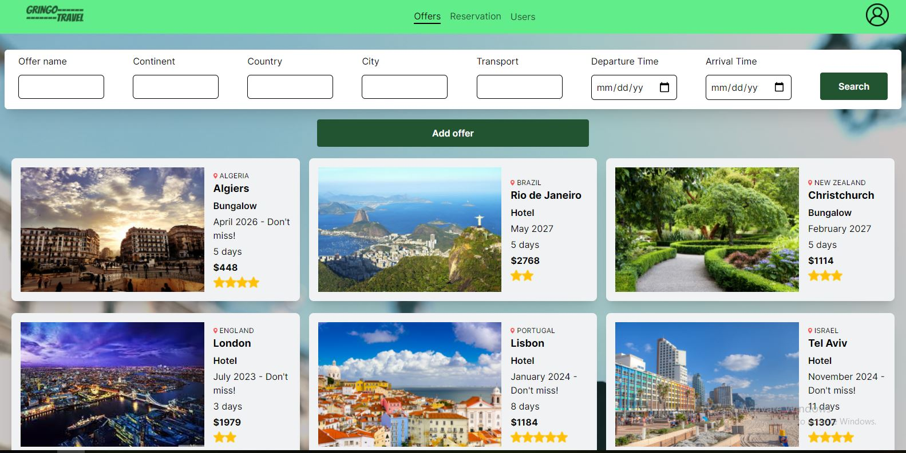
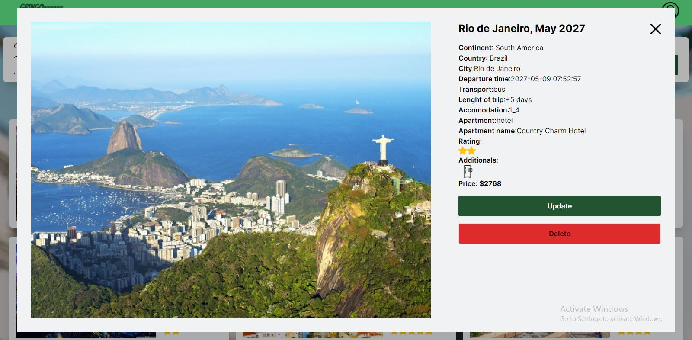
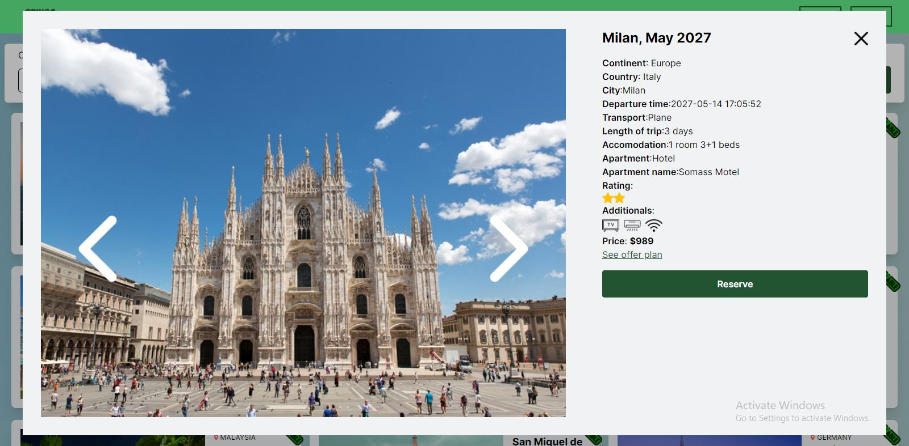
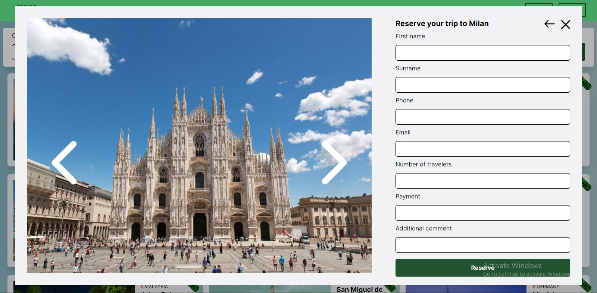
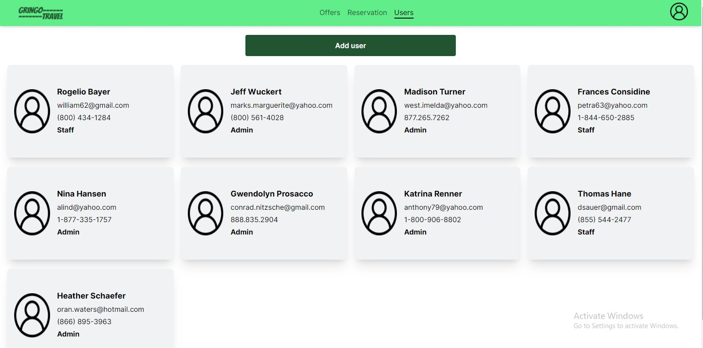
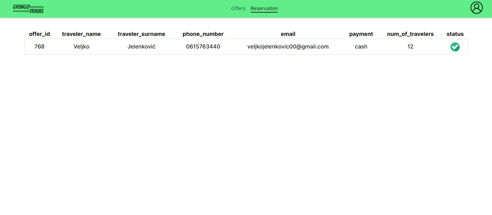
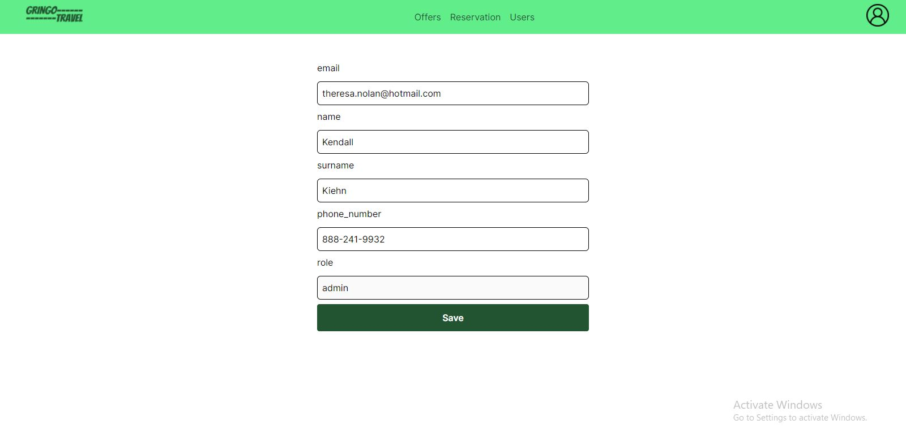

# Gringo Travel - Travel Agency Management System

Travel Agency management system made as a project on our college's final year. The goal was to build a full-stack web application that enables agency employees to perform CRUD operations with offers provided by agency itself, and application guests to reserve a trip for any offer that is available. Application is built with Laravel, React and Tailwind CSS, and also has Dockerfiles provided in Docker branch. 

## Table of contents

- [Overview](#overview)
  - [Screenshot](#screenshot)
  - [Installation and build](#installation-and-build)
- [Process](#process)
  - [Built with](#built-with)
  - [Useful resources](#useful-resources)
- [Authors](#authors)

## Overview

Application should be prepopulated with 60000 offers, out of which 50000 are available, and 10000 are past due. This is implemented by using [Faker](https://github.com/fzaninotto/Faker) library and [custom created providers](https://hofmannsven.com/2021/faker-provider-in-laravel).
You can access the application as employee or guest. Employees have two roles: Admin & Staff, and their permitted actions depend on the role. 
- If you choose to 'login as guest', you only have access to the offers, and you can book a trip for any of the offers available. Offer cards have their availability displayed in the top-right corner. You can also search for offers on a certain continent, country and city, choose a way of transport, or filter the offers by departure or/and arrival time. 
- When you login as Staff member, through login form on homepage, you can also see and search offers, but you can also add a new offer to the database, or update or delete an existing offer. You can also view your profile information, and update it if needed.
- Admin members also have all these permissions above, and apart from that, they can also add new Staff members, see the list of all reservations and accept each one of them.

### Screenshot

Screenshots of the application.
Home screen display, with Login and Guest buttons in navigation.

Login form for Agency employees.

Offers page, with search and pagination.

Single offer display, with detailed data and pictures carousel, and update & delete buttons for employees.

Form for entering new offer data by employees.

Guest display with a 'reserve' button.

Reservation form for guests.

Users display on admin page.

Reservations display for admin.

Profile update page for employees.

### Installation and Build

1. Download source code from this branch and extract it somewhere on your machine.
2. Start Apache and MySQL ports in your WAMP/XAMPP Control Panel.
3. Enter command prompt, change directory to the project path (cd /project_path).
4. Run 'php artisan migrate:fresh --seed' command, wait for the data to generate.
5. Run 'php artisan serve' command.
6. Enter another command prompt, change directory to the frontend folder of this project (cd /project_path/frontend).
7. Run 'npm run dev' command.
8. Open displayed address, after Local:

## Process

### Built with

- Semantic HTML5 markup
- Flexbox
- CSS Grid
- [Laravel](https://laravel.com/docs/9.x/installation) - PHP Framework 
- [React](https://reactjs.org/) - JS library
- [Tailwind CSS](https://v2.tailwindcss.com/docs) - Utility-first CSS Framework 
- [Docker](https://docs.docker.com) - Containerization platform 
- [React Toastify](https://npmjs.com/package/react-toastify)

### Useful resources

- [React + Laravel Full Stack application](https://www.youtube.com/watch?v=qJq9ZMB2Was) - This helped us for the crucial part of the project: integrating Laravel on the backend with React on the frontend.
- [Dockerize Laravel-Vite and React app](https://betterprogramming.pub/dockerize-laravel-vite-react-application-in-your-development-environment-a118aea4a02d) - This is an amazing article which helped us to better understand Dockerization process of Laravel-Vite and React applications. I'd recommend it to anyone still learning this concept.

## Authors

- Veljko Jelenković
  - GitHub - [https://github.com/jelenkoo10](https://github.com/jelenkoo10)
  - LinkedIn - [https://www.linkedin.com/in/veljko-jelenkovi%C4%87-182981250/](https://www.linkedin.com/in/veljko-jelenkovi%C4%87-182981250/)

- Lazar Joksimović 
  - GitHub - [https://github.com/kila369](https://github.com/kila369)
  - LinkedIn - [https://www.linkedin.com/in/lazar-joksimovi%C4%87-47406a260/](https://www.linkedin.com/in/lazar-joksimovi%C4%87-47406a260/)

- Jovan Živadinović
  - GitHub - [https://github.com/jovanzivadinovic](https://github.com/jovanzivadinovic)

- Veljko Stefanović 
  - GitHub - [https://github.com/VeljkoStefanovic613-2019](https://github.com/VeljkoStefanovic613-2019)
